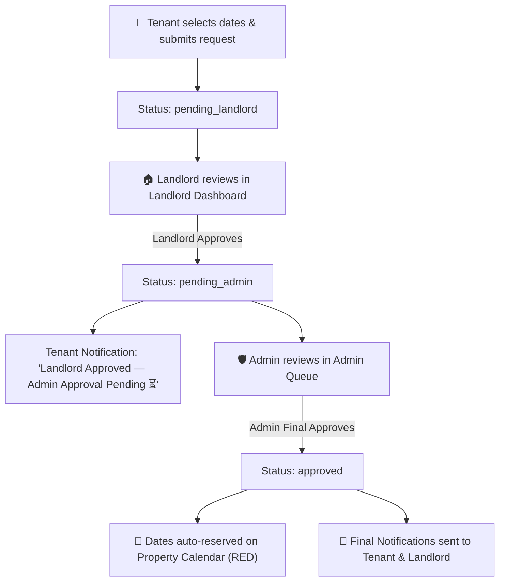

# RentEase — Property Rental and Listing Platform

> A comprehensive full-stack MERN application connecting Tenants, Landlords, and Administrators into a secure, feature-rich property rental ecosystem.

---

## 👥 Project Team & Group Members
1. **Md Hasanul Bashar** (ID: 23201222)
2. **Rufaiyah Islam** (ID: 23301595)
3. **Prapon Saha** (ID: 23201403)
4. **Anindya Pandob Rahul** (ID: 23201630)

---

## ✨ Key Features & Capabilities

### 🔐 1. Authentication & Role Gateway System
- **Explicit Role Selection Gateway**: Interactive modal supporting explicit role switching between `[ User / Tenant | Landlord | Admin ]`.
- **Nodemailer SMTP Email OTP Verification**:
  - 5-Digit numeric OTP generated and sent to user email upon signup using Nodemailer.
  - Tailored HTML Welcome Email dispatched upon successful account verification.
  - Secure verification: OTP codes expire in 10 minutes and are strictly delivered to user inbox.
- **Admin Security**: Admin login verified against secure environment variables (`ADMIN_EMAIL` and `ADMIN_PASSWORD`).
- **Dynamic Header Greetings**: Displays `"Hi, <Name>!"` on initial signup and `"Welcome back, <Name>!"` on returning sessions.

---

### 💻 2. Role-Specific Dashboards & Navigation
- **👤 Tenant / User Dashboard (`/user-dashboard`)**:
  - Browse verified rental properties with prices (BDT), descriptions, amenities, and location tags.
  - Real-time search bar for filtering by neighborhood, title, or keywords.
  - **"Add Wishes to Rent" (Wishlist)**: Save favorite properties to personal wishlist list (`My Wishes to Rent`).
  - **Interactive Availability Calendar**: Preview booked vs open dates on property calendars.
  - Submit rental booking requests for specific dates.
- **🏠 Landlord Dashboard (`/landlord-dashboard`)**:
  - Create property listings with price, location, description, and amenity tags.
  - View account verification status (`PENDING_VERIFICATION` vs `APPROVED`).
  - Interactive **Visual Availability Calendar**: Block or unblock property dates.
  - Review incoming tenant booking requests and approve/reject them.
- **🛡 Admin Dashboard (`/admin`)**:
  - Live KPI Stat Cards overviewing platform counts.
  - **Landlord Verification Queue**: Approve or reject new landlord account applications.
  - **Listing Approval Queue**: Review and approve property listings submitted by landlords.
  - **Dispute / Complaint Management**: Track, review, and resolve platform complaints.
  - **Tenant Booking Approval Queue**: Final platform authorization for tenant rental bookings.

---

### 🔄 3. 3-Tier Multi-Role Booking Workflow


---

### 🎨 4. High-Contrast Dark Glassmorphism UI
- Modern dark-navy glassmorphic theme (`rgba(13, 20, 37, 0.85)` with blur backdrop filter).
- High-contrast text & badges for high legibility across dark backgrounds.
- **Role-Distinct Glowing Top-Border Accents**:
  - 🟣 Tenant: `borderTop: 3px solid var(--purple)`
  - 🟢 Landlord: `borderTop: 3px solid var(--green)`
  - 🩵 Admin: `borderTop: 3px solid var(--teal)`
- **"Mark All as Read" Dismissal**:
  - Click **"✔️ Mark All as Read"** to clear notification panels.
  - Toggle **"👁️ Show Dismissed"** to view or restore historical notification logs.

---

## 🛠 Technology Stack

### Frontend
- **Framework**: React 18, Vite
- **Routing**: React Router DOM (v6) with dynamic root redirection
- **HTTP Client**: Axios
- **Styling**: Vanilla CSS with Design System Tokens, Glassmorphism, CSS Grid, and Animations

### Backend
- **Runtime**: Node.js, Express.js
- **Database**: MongoDB / Mongoose ODM (Atlas Cloud & Local support)
- **Authentication**: Bcryptjs, JWT Token state
- **Email Service**: Nodemailer (Gmail SMTP SSL)
- **Environment**: Dotenv

---

## 🚀 Local Development Setup

### 1. Clone Repository
```bash
git clone https://github.com/Hasanul-Bashar/Project_470.git
cd Project_470
```

### 2. Configure Environment Variables
Create a `server/.env` file:
```env
PORT=5000
MONGO_URI=mongodb+srv://<username>:<password>@cluster0.mongodb.net/rentease?retryWrites=true&w=majority
ADMIN_EMAIL=admin@rentease.com
ADMIN_PASSWORD=admin12345
SYSTEM_EMAIL=rahul.academic321@gmail.com
SYSTEM_EMAIL_PASSWORD=gxdekbrtidlrxhgh
```

### 3. Install Dependencies & Start Servers
```bash
# Terminal 1 — Backend API
cd server
npm install
npm run dev

# Terminal 2 — Frontend App
cd client
npm install
npm run dev
```
Open **http://localhost:5173** in your browser.

---

## 📡 API Endpoints Reference

### 🔐 Authentication (`/api/auth`)
| Method | Endpoint | Description |
|---|---|---|
| `POST` | `/api/auth/signup` | Registers new User/Landlord & sends 5-digit OTP |
| `POST` | `/api/auth/verify-otp` | Verifies email OTP & activates account |
| `POST` | `/api/auth/login` | Authenticates User, Landlord, or Admin |
| `POST` | `/api/auth/resend-otp` | Resends new 5-digit OTP email |

### 🏠 Listings (`/api/listings`)
| Method | Endpoint | Description |
|---|---|---|
| `GET` | `/api/listings` | Get property listings |
| `POST` | `/api/listings` | Landlord submits property listing |
| `PATCH` | `/api/listings/:id/availability` | Landlord updates booked dates calendar |

### 📅 Bookings (`/api/bookings`)
| Method | Endpoint | Description |
|---|---|---|
| `POST` | `/api/bookings` | Tenant submits date booking request |
| `GET` | `/api/bookings` | Fetch bookings (filtered by role/user) |
| `PATCH` | `/api/bookings/:id/landlord-approve` | Landlord approves booking request |
| `PATCH` | `/api/bookings/:id/admin-approve` | Admin final approves booking & updates calendar |
| `PATCH` | `/api/bookings/:id/reject` | Rejects booking request |

### 🛡 Admin (`/api/admin`)
| Method | Endpoint | Description |
|---|---|---|
| `GET` | `/api/admin/stats` | Platform KPI counts |
| `GET` | `/api/admin/landlords/pending` | Unverified landlord list |
| `PATCH` | `/api/admin/landlords/:id/verify` | Approve or reject landlord account |
| `GET` | `/api/admin/listings/pending` | Pending listing queue |
| `PATCH` | `/api/admin/listings/:id/status` | Approve or reject listing |

### 📣 Complaints (`/api/complaints`)
| Method | Endpoint | Description |
|---|---|---|
| `POST` | `/api/complaints` | Submit platform complaint |
| `GET` | `/api/complaints` | List complaints (Admin) |
| `PATCH` | `/api/complaints/:id/status` | Update complaint status & resolution note |

---

## 🌐 Deployment (Vercel)

This repository is configured for direct Vercel deployment via `vercel.json`:
- **Serverless API**: `server/server.js` (`/api/*`)
- **Static Frontend**: `client/` built with Vite (`dist`)

To deploy updates, push to `main` branch:
```bash
git add .
git commit -m "update project features and documentation"
git push origin main
```
Vercel automatically builds and deploys the latest version!
