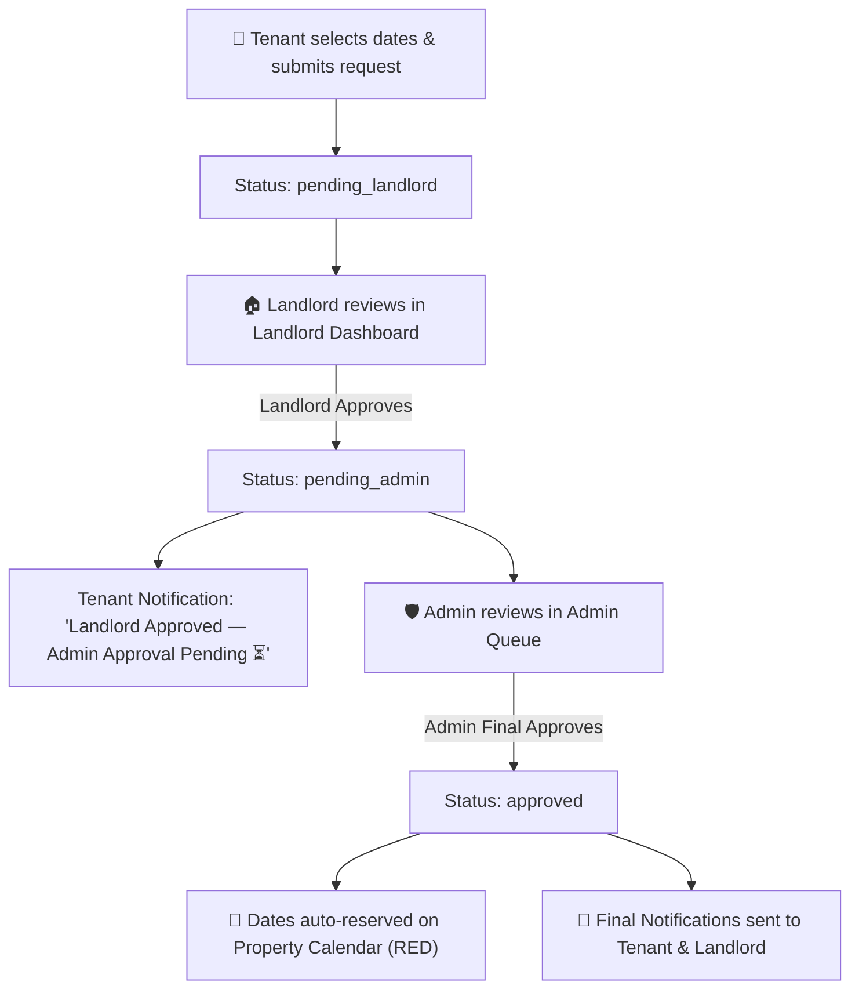

# RentEase — Property Rental and Listing Platform

> A comprehensive full-stack MERN application connecting Tenants, Landlords, and Administrators into a secure, feature-rich property rental ecosystem following strict MVC Architecture.

---

## 👥 Project Team & Group Members
1. **Md Hasanul Bashar** (ID: 23201222)
2. **Rufaiyah Islam** (ID: 23301595)
3. **Prapon Saha** (ID: 23201403)
4. **Anindya Pandob Rahul** (ID: 23201630)

---

## 🏛 Software Architecture — Model-View-Controller (MVC) Pattern

RentEase is strictly engineered using the **Model-View-Controller (MVC) Architecture Pattern**:

```
                       ┌──────────────────────────────────────────────┐
                       │                   VIEW                       │
                       │           (React 18 + Vite SPA)              │
                       │   Client UI, User/Landlord/Admin Views       │
                       └──────────────────────┬───────────────────────┘
                                              │
                              User Actions    │ HTTP REST API Responses
                              (Forms, Clicks) │ (JSON)
                                              ▼
                       ┌──────────────────────────────────────────────┐
                       │                CONTROLLER                    │
                       │          (Express Controllers)               │
                       │ auth, listing, booking, chat, trustScore Ctlr│
                       └──────────────────────┬───────────────────────┘
                                              │
                             Manipulates/     │ Returns
                             Queries          │ Data
                                              ▼
                       ┌──────────────────────────────────────────────┐
                       │                  MODEL                       │
                       │          (Mongoose ORM / MongoDB)            │
                       │ User, Listing, Booking, Chat, TrustScore     │
                       └──────────────────────────────────────────────┘
```

### MVC Architecture Breakdown:

1. **📦 Model (M) — Data & Business Entities (`server/models/`)**:
   - `User.js`: User credentials, roles, email OTP verification states, and landlord verification status.
   - `Listing.js`: Rental property details, location, price, status, landlord ID, and availability calendar booked dates.
   - `Booking.js`: 3-tier booking requests, requested dates, and approval state machine.
   - `Chat.js`: Message threads between tenants and landlords tied to specific listings.
   - `TrustScore.js`: Weighted trust score calculations, recency time-decay factor, landlord flags, provisional exclusion appeals, and timestamped audit logs.
   - `Complaint.js`: Dispute submission schema and admin resolution logs.

2. **🎨 View (V) — User Interface & Presentation (`client/src/`)**:
   - **Role Dashboards**: `UserDashboard.jsx`, `LandlordListings.jsx`, `AdminDashboard.jsx`, `ComplaintsPage.jsx`.
   - **UI Components**: `RoleGatewayModal.jsx`, `ChatModal.jsx`, `TrustScoreModal.jsx`, `TrustScoreQueue.jsx`, `StatCards.jsx`, `LandlordTable.jsx`, `ListingQueue.jsx`, `BookingQueue.jsx`, `AvailabilityCalendar.jsx`.
   - Renders data from JSON API responses and captures user interactions.

3. **⚙️ Controller (C) — Application Logic & Handlers (`server/controllers/` & `server/routes/`)**:
   - `authController.js`: Manages registration, Nodemailer OTP dispatch/verification, and login authentication.
   - `listingController.js`: Controls property listing creation, landlord filtering, and calendar availability updates.
   - `bookingController.js`: Controls 3-tier booking requests and approval state transitions.
   - `chatController.js`: Controls tenant-landlord message thread creation and message exchanges.
   - `trustScoreController.js`: Calculates weighted trust scores with recency time-decay, manages landlord flags, tenant provisional exclusion appeals, and admin appeal reviews.
   - `adminController.js`: Handles KPI statistics, landlord verification, and listing approval queues.
   - `complaintController.js`: Manages dispute creation and resolution workflows.

---

## ✨ Key Features & Capabilities

### 🔐 1. Authentication & Role Gateway System
- **Explicit Role Selection Gateway**: Interactive modal supporting explicit role switching between `[ User / Tenant | Landlord | Admin ]`.
- **Nodemailer SMTP Email OTP Verification**:
  - 5-Digit numeric OTP generated and sent to user email upon signup using Nodemailer.
  - Tailored HTML Welcome Email dispatched upon successful account verification.
  - Secure verification: OTP codes expire in 10 minutes and are strictly delivered to user inbox.
- **Admin Security**: Admin login verified against secure environment variables (`ADMIN_EMAIL` and `ADMIN_PASSWORD`).

---

### 💬 2. Tenant-Landlord Messaging Chat Thread
- **Listing-Linked Messaging**: Direct chat thread between tenants and landlords attached to specific property listings.
- **Interactive Chat Modal (`ChatModal.jsx`)**: Real-time message log displaying timestamps, sender roles (`Tenant`, `Landlord`, `System`), and instant refresh.

---

### 🛡 3. Tenant Blacklist & Trust Score System
- **Weighted Trust Scoring Engine**:
  - Base Score: **100 points**.
  - **Landlord Flags**: Penalty based on severity (`critical`: -30, `high`: -20, `medium`: -10, `low`: -5).
  - **Time-Decay Recency Factor**: Flags decay over time (100% impact ≤30 days, 75% 31–90 days, 50% 91–180 days, 25% >180 days).
  - **Payment History**: `on_time` (+2 bonus), `late` (-5), `unpaid` (-15).
  - **Normalized Score Bands**:
    - 🟢 `90 - 100`: **Excellent**
    - 🔵 `75 - 89`: **Good**
    - 🟡 `60 - 74`: **Fair**
    - 🟠 `40 - 59`: **At Risk**
    - 🔴 `< 40`: **Blacklisted**
- **Provisional Exclusion & Dispute Mechanism**:
  - Tenants can submit appeals (`TrustScoreModal.jsx`) for flagged entries.
  - Submitting an appeal sets `isProvisionallyExcluded = true` (0 point penalty deducted during active review) and recalculates trust score instantly.
- **Admin Review Queue (`TrustScoreQueue.jsx`)**:
  - Embedded in `AdminDashboard.jsx`. Admins can review pending appeals to **Approve (Dismiss Flag)** or **Reject (Reinstate Penalty)**.

---

### 🔄 4. 3-Tier Multi-Role Booking Workflow


---

### 🎨 5. High-Contrast Dark Glassmorphism UI
- Modern dark-navy glassmorphic theme (`rgba(13, 20, 37, 0.85)` with blur backdrop filter).
- High-contrast text & badges for high legibility across dark backgrounds.
- **Role-Distinct Glowing Top-Border Accents**:
  - 🟣 Tenant: `borderTop: 3px solid var(--purple)`
  - 🟢 Landlord: `borderTop: 3px solid var(--green)`
  - 🩵 Admin: `borderTop: 3px solid var(--teal)`
- **"Mark All as Read" Dismissal**:
  - Click **"✔️ Mark All as Read"** to clear notification panels.
  - Toggle **"👁️ Show Dismissed"** to view or restore historical notification logs.

---

## 🗂 Folder Structure (MVC Architecture)

```
rentease/
├── client/                      ← VIEW LAYER (V)
│   └── src/
│       ├── context/AuthContext.jsx
│       ├── services/            ← API Service Abstraction
│       │   ├── adminApi.js
│       │   ├── listingsApi.js
│       │   ├── bookingsApi.js
│       │   ├── chatApi.js
│       │   ├── trustScoreApi.js
│       │   └── complaintsApi.js
│       ├── components/          ← UI View Components
│       │   ├── Header.jsx
│       │   ├── Modal.jsx
│       │   ├── auth/RoleGatewayModal.jsx
│       │   ├── chat/ChatModal.jsx
│       │   ├── trustScore/TrustScoreModal.jsx
│       │   ├── admin/
│       │   │   ├── StatCards.jsx
│       │   │   ├── LandlordTable.jsx
│       │   │   ├── ListingQueue.jsx
│       │   │   ├── BookingQueue.jsx
│       │   │   ├── TrustScoreQueue.jsx
│       │   │   └── AvailabilityCalendar.jsx
│       └── pages/               ← Dashboard Views
│           ├── UserDashboard.jsx
│           ├── LandlordListings.jsx
│           ├── AdminDashboard.jsx
│           └── ComplaintsPage.jsx
│
└── server/                      ← CONTROLLER & MODEL LAYERS (C & M)
    ├── models/                  ← MODEL LAYER (M)
    │   ├── User.js
    │   ├── Listing.js
    │   ├── Booking.js
    │   ├── Chat.js
    │   ├── TrustScore.js
    │   └── Complaint.js
    ├── controllers/             ← CONTROLLER LAYER (C)
    │   ├── authController.js
    │   ├── listingController.js
    │   ├── bookingController.js
    │   ├── chatController.js
    │   ├── trustScoreController.js
    │   ├── adminController.js
    │   └── complaintController.js
    ├── routes/                  ← ROUTING TABLE
    │   ├── authRoutes.js
    │   ├── listingRoutes.js
    │   ├── bookingRoutes.js
    │   ├── chatRoutes.js
    │   ├── trustScoreRoutes.js
    │   ├── adminRoutes.js
    │   └── complaintRoutes.js
    ├── middleware/
    │   └── auth.middleware.js   ← Auth & RBAC Middleware
    ├── services/
    │   └── emailService.js      ← Nodemailer Email Dispatch
    └── server.js                ← Application Entry Point
```

---

## 🛠 Technology Stack

### Frontend
- **Framework**: React 18, Vite
- **Routing**: React Router DOM (v6) with dynamic root redirection
- **HTTP Client**: Axios
- **Styling**: Vanilla CSS with Design System Tokens, Glassmorphism, CSS Grid, and Animations

### Backend
- **Runtime**: Node.js, Express.js
- **Database**: MongoDB / Mongoose ODM (Atlas Cloud & Local support)
- **Authentication**: Bcryptjs, JWT Token state
- **Email Service**: Nodemailer (Gmail SMTP SSL)
- **Environment**: Dotenv

---

## 🚀 Local Development Setup

### 1. Clone Repository
```bash
git clone https://github.com/Hasanul-Bashar/Project_470.git
cd Project_470
```

### 2. Configure Environment Variables
Create a `server/.env` file:
```env
PORT=5000
MONGO_URI=mongodb+srv://<username>:<password>@cluster0.mongodb.net/rentease?retryWrites=true&w=majority
ADMIN_EMAIL=admin@rentease.com
ADMIN_PASSWORD=admin12345
SYSTEM_EMAIL=rahul.academic321@gmail.com
SYSTEM_EMAIL_PASSWORD=gxdekbrtidlrxhgh
```

### 3. Install Dependencies & Start Servers
```bash
# Terminal 1 — Backend API
cd server
npm install
npm run dev

# Terminal 2 — Frontend App
cd client
npm install
npm run dev
```
Open **http://localhost:5173** in your browser.

---

## 📡 API Endpoints Reference

### 🔐 Authentication (`/api/auth`)
| Method | Endpoint | Description |
|---|---|---|
| `POST` | `/api/auth/signup` | Registers new User/Landlord & sends 5-digit OTP |
| `POST` | `/api/auth/verify-otp` | Verifies email OTP & activates account |
| `POST` | `/api/auth/login` | Authenticates User, Landlord, or Admin |
| `POST` | `/api/auth/resend-otp` | Resends new 5-digit OTP email |

### 🏠 Listings (`/api/listings`)
| Method | Endpoint | Description |
|---|---|---|
| `GET` | `/api/listings` | Get property listings |
| `POST` | `/api/listings` | Landlord submits property listing |
| `PATCH` | `/api/listings/:id/availability` | Landlord updates booked dates calendar |

### 💬 Chat (`/api/chats`)
| Method | Endpoint | Description |
|---|---|---|
| `GET` | `/api/chats` | Fetch chat threads for user |
| `GET` | `/api/chats/listing/:listingId` | Get or create chat thread for listing |
| `POST` | `/api/chats/:chatId/messages` | Send message in chat thread |

### 🛡 Trust Score & Blacklist (`/api/trust-score`)
| Method | Endpoint | Description |
|---|---|---|
| `GET` | `/api/trust-score/:tenantId` | Fetch trust score, band, flags, and audit trail |
| `POST` | `/api/trust-score/flag` | Landlord flags a tenant |
| `POST` | `/api/trust-score/appeal` | Tenant submits appeal (provisionally excludes flag penalty) |
| `PATCH` | `/api/trust-score/review-appeal` | Admin approves or rejects appeal |
| `GET` | `/api/trust-score/admin/queue` | Admin trust score & appeals queue |

### 📅 Bookings (`/api/bookings`)
| Method | Endpoint | Description |
|---|---|---|
| `POST` | `/api/bookings` | Tenant submits date booking request |
| `GET` | `/api/bookings` | Fetch bookings (filtered by role/user) |
| `PATCH` | `/api/bookings/:id/landlord-approve` | Landlord approves booking request |
| `PATCH` | `/api/bookings/:id/admin-approve` | Admin final approves booking & updates calendar |
| `PATCH` | `/api/bookings/:id/reject` | Rejects booking request |

### 🛡 Admin (`/api/admin`)
| Method | Endpoint | Description |
|---|---|---|
| `GET` | `/api/admin/stats` | Platform KPI counts |
| `GET` | `/api/admin/landlords/pending` | Unverified landlord list |
| `PATCH` | `/api/admin/landlords/:id/verify` | Approve or reject landlord account |
| `GET` | `/api/admin/listings/pending` | Pending listing queue |
| `PATCH` | `/api/admin/listings/:id/status` | Approve or reject listing |

### 📣 Complaints (`/api/complaints`)
| Method | Endpoint | Description |
|---|---|---|
| `POST` | `/api/complaints` | Submit platform complaint |
| `GET` | `/api/complaints` | List complaints (Admin) |
| `PATCH` | `/api/complaints/:id/status` | Update complaint status & resolution note |

---

## 🌐 Deployment (Vercel)

This repository is configured for direct Vercel deployment via `vercel.json`:
- **Serverless API**: `server/server.js` (`/api/*`)
- **Static Frontend**: `client/` built with Vite (`dist`)
